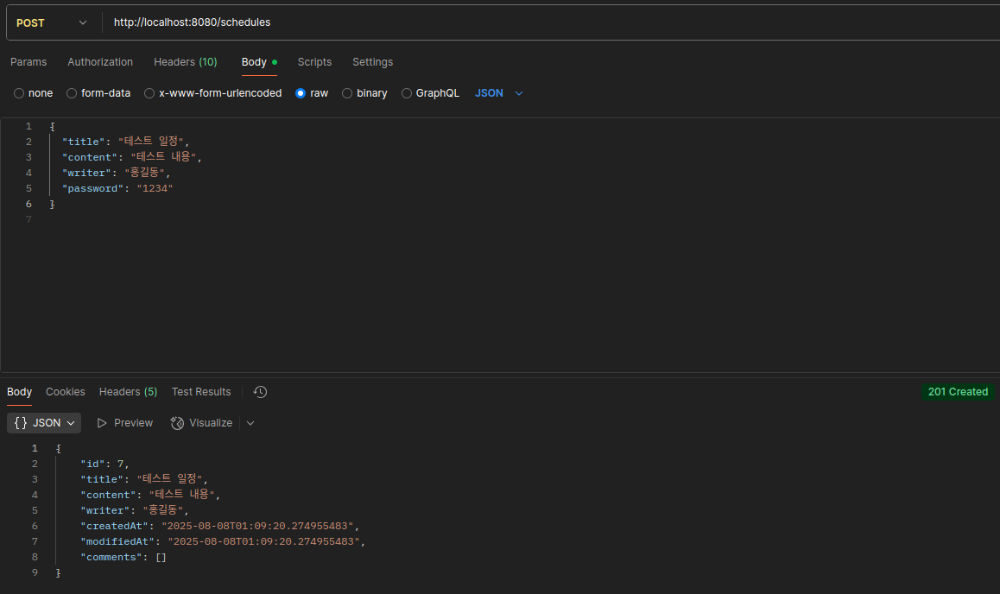
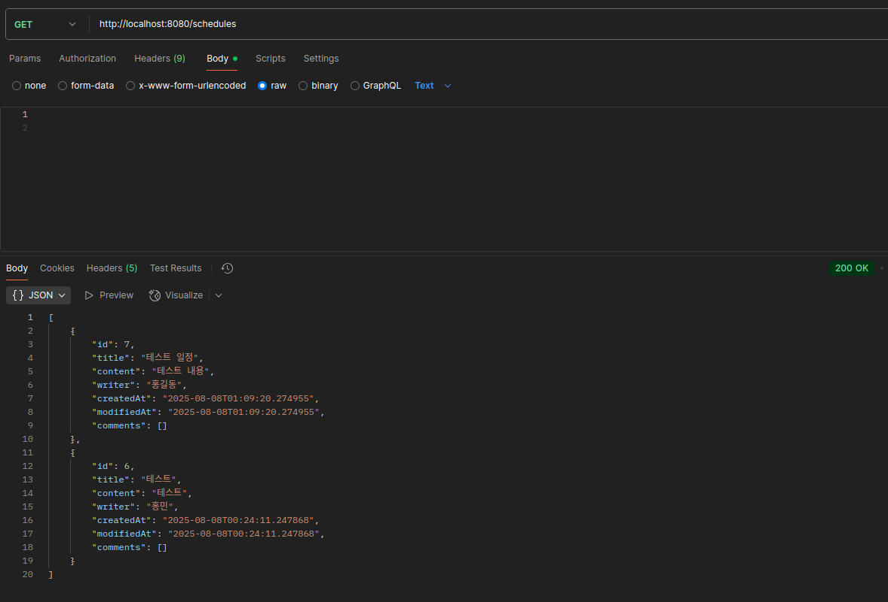
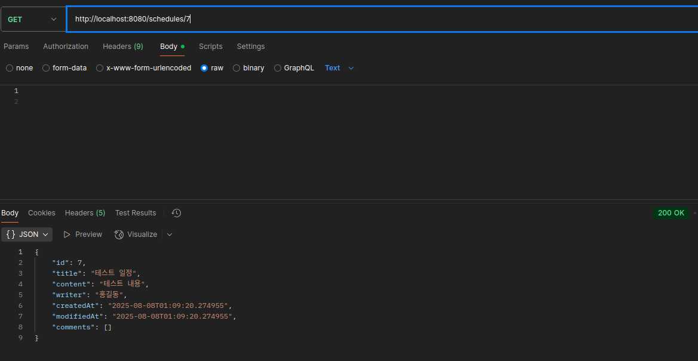
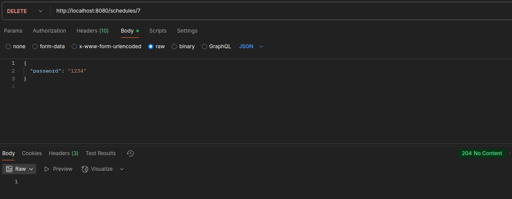
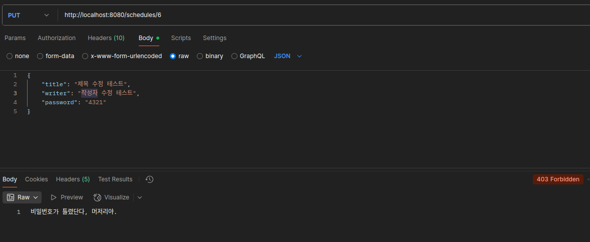

# 📅 캘린더 프로젝트

## 🌐 URL 구조
| URL                          | 메서드 | 설명               |
|------------------------------|--------|--------------------|
| `/schedules`                 | GET    | 일정 전체 조회     |
| `/schedules/{id}`            | GET    | 일정 상세 조회     |
| `/schedules`                 | POST   | 일정 등록          |
| `/schedules/{id}`            | PUT    | 일정 수정 (비밀번호 필요) |
| `/schedules/{id}`            | DELETE | 일정 삭제 (비밀번호 필요) |
| `/schedules/{id}/comments`   | POST   | 댓글 등록 (최대 10개) |

---

# 📄 API 명세서

## 1. Schedule API

### 1.1 일정 생성

| 항목 | 내용 |
|------|------|
| **URL** | POST /schedules |
| **Request Body** | title (String, 필수, 최대 30자) content (String, 필수, 최대 200자) writer (String, 필수) password (String, 필수) |
| **Response** | 201 Created |
| **Response Body** | id, title, content, writer, createdAt |
| **Error** | 400 Bad Request - 필수값 누락, 글자수 초과 |

### 1.2 일정 목록 조회

| 항목 | 내용 |
|------|------|
| **URL** | GET /schedules |
| **Request** | (선택) writer 쿼리 파라미터 |
| **Response** | 200 OK |
| **Response Body** | 일정 배열(id, title, writer, createdAt) |

### 1.3 일정 단건 조회

| 항목 | 내용 |
|------|------|
| **URL** | GET /schedules/{id} |
| **Request** | 없음 |
| **Response** | 200 OK |
| **Response Body** | id, title, content, writer, createdAt, comments[] |

### 1.4 일정 수정

| 항목 | 내용 |
|------|------|
| **URL** | PUT /schedules/{id} |
| **Request Body** | title (String, 필수) writer (String, 필수) password (String, 필수) |
| **Response** | 200 OK |
| **Response Body** | 수정된 일정 정보 |
| **Error** | 403 Forbidden - 비밀번호 불일치 400 Bad Request - 유효성 실패 |

### 1.5 일정 삭제

| 항목 | 내용 |
|------|------|
| **URL** | DELETE /schedules/{id} |
| **Request Body** | password (String, 필수) |
| **Response** | 204 No Content |
| **Error** | 403 Forbidden - 비밀번호 불일치 404 Not Found - 일정 없음 |

---

## 2. Comment API

### 2.1 댓글 작성

| 항목 | 내용 |
|------|------|
| **URL** | POST /schedules/{id}/comments |
| **Request Body** | comment (String, 필수, 최대 100자) writer (String, 필수) password (String, 필수) |
| **Response** | 201 Created |
| **Response Body** | id, comment, writer, createdAt |
| **Error** | 400 Bad Request - 필수값 누락, 글자수 초과 403 Forbidden - 댓글 10개 초과 시 |

---

### ⚠️ 공통 에러 코드

| 상태 코드 | 설명 |
|-----------|------|
| 400 | 잘못된 요청 (파라미터 누락, 형식 오류 등) |
| 403 | 비밀번호 불일치 |
| 404 | 존재하지 않는 리소스 요청 |

---

# 🗂 ERD

## 📝 Schedule

| 필드명    | 타입           | 설명       |
|-----------|----------------|------------|
| id        | Long           | PK         |
| title     | String         | 일정 제목  |
| content   | String         | 일정 내용  |
| writer    | String         | 작성자명   |
| password  | String         | 비밀번호   |
| createdAt | LocalDateTime  | 생성 시각  |
| updatedAt | LocalDateTime  | 수정 시각  |

---

## 💬 Comment

| 필드명     | 타입           | 설명               |
|------------|----------------|--------------------|
| id         | Long           | PK                 |
| scheduleId | Long           | FK - Schedule 참조 |
| comment    | String         | 댓글 내용          |
| writer     | String         | 댓글 작성자        |
| password   | String         | 비밀번호           |
| createdAt  | LocalDateTime  | 댓글 생성 시각     |
| updatedAt  | LocalDateTime  | 댓글 수정 시각     |

---

# 📷 캡쳐

