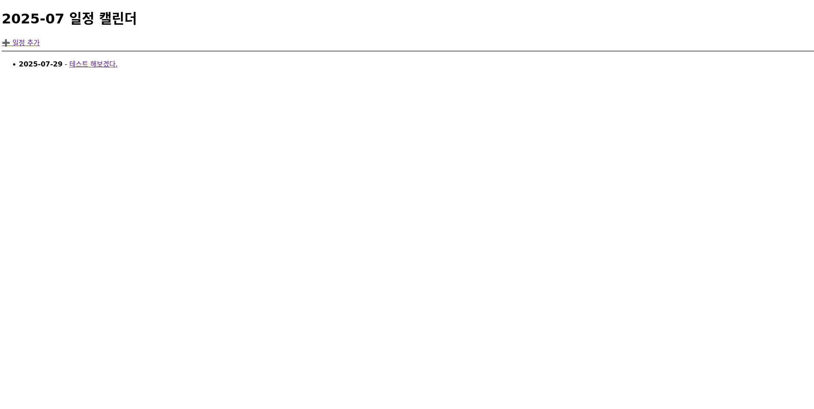
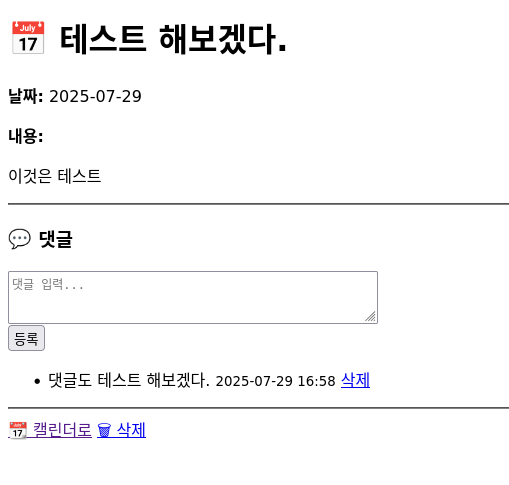
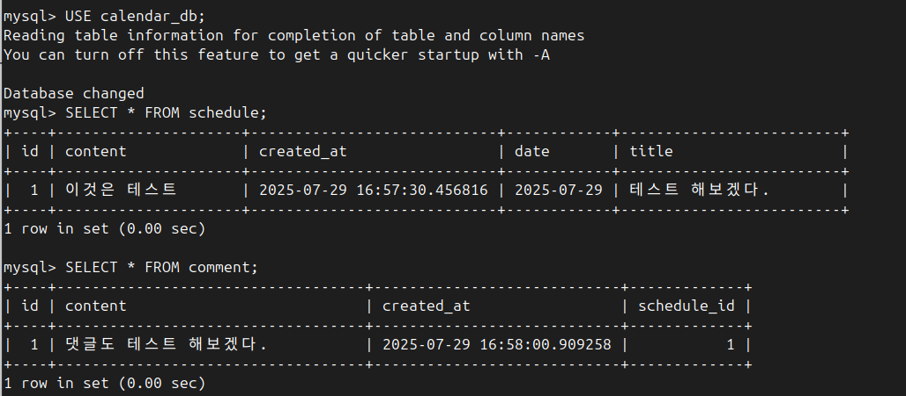

# 📅 일정 관리 캘린더 프로젝트 (Schedule Calendar)
부트캠프 3주차 과제로 제작한 Spring Boot 기반 일정 관리 웹앱입니다. 
사용자는 일정을 등록하고, 월별로 일정을 확인하며, 각 일정에 댓글을 남길 수 있습니다.

---

## ✅ 주요 기능
| 기능             | 설명 |
|------------------|------|
| 📅 **월별 일정 확인** | 캘린더 페이지(`/calendar`)에서 월별로 등록된 일정 확인 |
| ➕ **일정 등록**       | 일정 제목, 내용, 날짜를 입력해 생성 가능 |
| 📌 **일정 상세 보기**   | 일정 클릭 시 내용과 댓글 확인 가능 |
| 💬 **댓글 등록/삭제** | 일정 상세 페이지에서 댓글 작성 및 삭제 가능 |
| ❌ **일정 삭제**       | 일정 상세 페이지에서 삭제 버튼 제공 |

---

## 🧱 도메인 구조

### 📄 Schedule
| 필드명     | 타입          | 설명         |
|------------|---------------|--------------|
| id         | Long          | PK           |
| title      | String        | 일정 제목    |
| content    | String        | 일정 내용    |
| date       | LocalDate     | 일정 날짜    |
| createdAt  | LocalDateTime | 생성 시각    |

### 💬 Comment
| 필드명     | 타입          | 설명               |
|------------|---------------|--------------------|
| id         | Long          | PK                 |
| schedule   | Schedule      | 연관된 일정 (FK)    |
| content    | String        | 댓글 내용          |
| createdAt  | LocalDateTime | 댓글 작성 시각     |

---

## 🌐 URL 구조
| URL                          | 메서드 | 설명               |
|------------------------------|--------|--------------------|
| `/calendar`                  | GET    | 월별 일정 리스트    |
| `/schedule/write`           | GET    | 일정 등록 폼        |
| `/schedule/write`           | POST   | 일정 등록 처리      |
| `/schedule/detail?id={id}`  | GET    | 일정 상세 페이지     |
| `/schedule/delete?id={id}`  | GET    | 일정 삭제           |
| `/comment/write`            | POST   | 댓글 등록 처리      |
| `/comment/delete?id=...`    | GET    | 댓글 삭제 처리      |

---

## 🛠 기술 스택
- Java 17
- Spring Boot 3
- Spring Web / Thymeleaf
- Spring Data JPA
- MySQL
- Gradle

---

## 🖥 실행 방법
1. `application.properties`에 본인 MySQL 설정 추가
2. 테이블 자동 생성됨 (`spring.jpa.hibernate.ddl-auto=update`)
3. 프로젝트 실행 후 브라우저에서 `http://localhost:8080/calendar` 접속

---

## 🎯 캡처 예시
> 일정 등록 후:
- `/calendar` 에 일정이 리스트로 표시됨
- 일정 클릭 시 댓글 작성 가능

## 📷 캡처




---

## 📂 프로젝트 구조 예시
```
src
├── controller
│   ├── ScheduleController.java
│   └── CommentController.java
├── service
│   ├── ScheduleService.java
│   └── CommentService.java
├── repository
│   ├── ScheduleRepository.java
│   └── CommentRepository.java
├── entity
│   ├── Schedule.java
│   └── Comment.java
└── resources/templates
    ├── calendar.html
    ├── write.html
    └── detail.html
```

---

## 🙋‍♀️ 기타
- UI는 최소 구현 (캘린더 그리드 형태 아님, 리스트 방식)
- 프론트엔드보다는 백엔드 설계/기능 구현에 집중함


